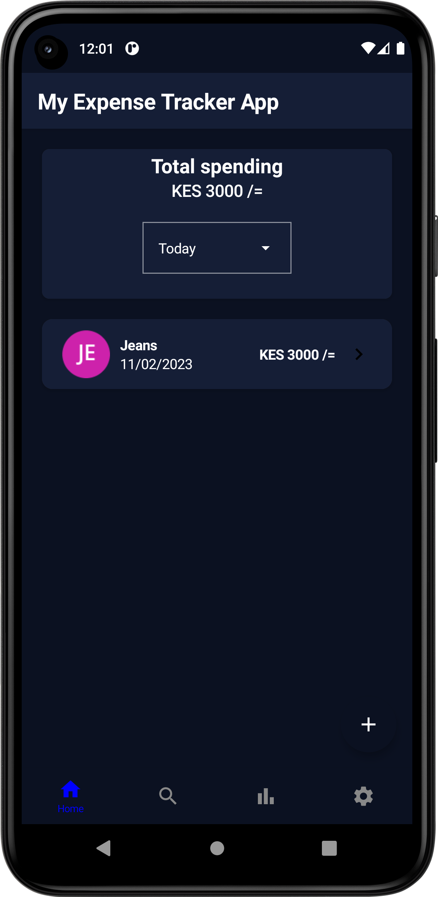
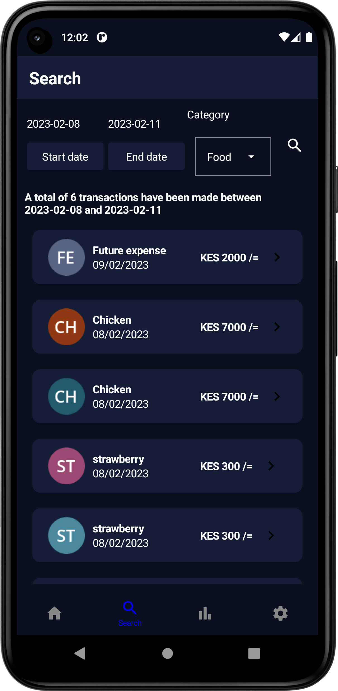
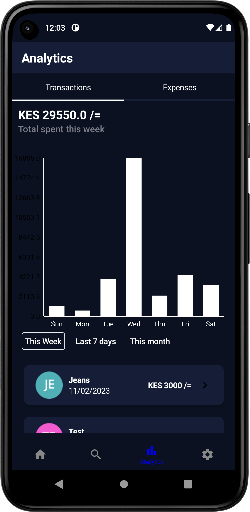
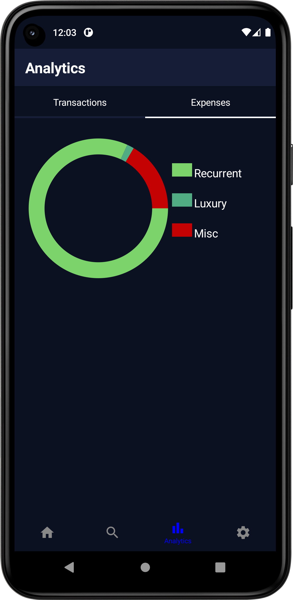
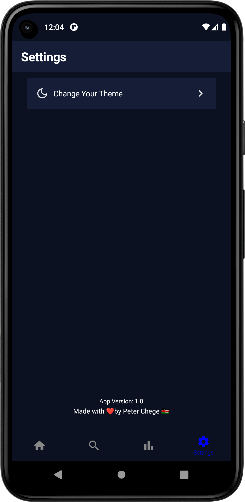

# Expense Tracker Application

This is a native android application built with Jetpack Compose to manage the users expenses and transactions
and visualizes the data in a bar and pie chart.The app is completely offline and all the data is in 
a room database so no need for internet connection

## Screenshots of the app
  

 

# Tech Stack.
This project uses many of the popular libraries, plugins and tools of the android ecosystem.

## Libraries.

- [Hilt](https://github.com/google/hilt) - Dependency Injection library.
- [Jetpack](https://developer.android.com/jetpack)
    -   [Android KTX](https://developer.android.com/kotlin/ktx.html) - Provide concise, idiomatic Kotlin to Jetpack and Android platform APIs.
    - [AndroidX](https://developer.android.com/jetpack/androidx) - Major improvement to the original Android [Support Library](https://developer.android.com/topic/libraries/support-library/index), which is no longer maintained.
    -   [Lifecycle](https://developer.android.com/topic/libraries/architecture/lifecycle) - Perform actions in response to a change in the lifecycle status of another component, such as activities and fragments.
    - [Room](https://developer.android.com/training/data-storage/room) - Provides an abstraction layer over SQLite used for offline data caching.
    - [Navigation Component](https://developer.android.com/guide/navigation/navigation-getting-started)-Component that allows easier implementation of navigation from simple button clicks to more complex patterns.

- [OkHttp-Logging-Interceptor](https://github.com/square/okhttp/blob/master/okhttp-logging-interceptor/README.md) - Logs HTTP request and response data.
- [Coroutines](https://github.com/Kotlin/kotlinx.coroutines) - Library Support for coroutines.
- [Flow](https://developer.android.com/kotlin/flow) - Flows are built on top of coroutines and can provide multiple values. A flow is conceptually a stream of data that can be computed asynchronously.
- [Timber](https://github.com/JakeWharton/timber)-Library for easier logging.
- [Material Design](https://material.io/develop/android/docs/getting-started/) - Build awesome beautiful UIs.
- [kotlinx.coroutines](https://github.com/Kotlin/kotlinx.coroutines) - Library Support for coroutines,provides runBlocking coroutine builder used in tests.

## Extras
- [GitHub Actions](https://github.com/chege4179/ExpenseTrackerApp/actions) - GitHub actions is used in this project to check for syntax correctness using linting, execute the unit tests, generate a new package and deploying the apk using [Firebase App Distribution](https://firebase.google.com/docs/app-distribution) when pushing changes to the dev branch or when making a pull request to the main branch.